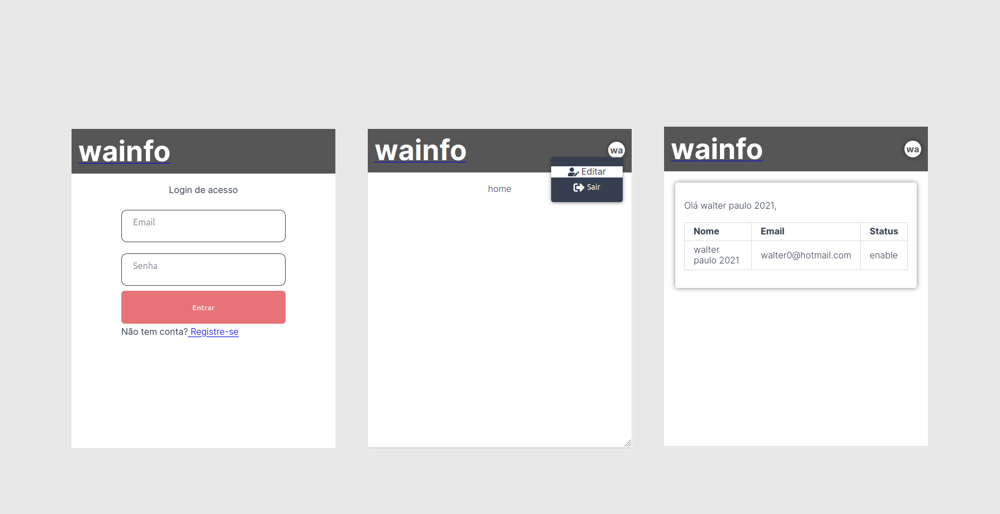

## Wainfo

- Login de acesso;
- Rotas protegidas;
- Validação com Token;
- Design responsivo;
- Projeto Web;

### Tecnologias

- React JS v18.0.0;
- Vite JS v2.9.0;
- Styled Components v5.3.5
- TypeScript

### Init

```
cd wainfo
yarn
yarn dev
```



### Modelo


[Ver vídeo](https://youtu.be/MOkKelcWtjc)
